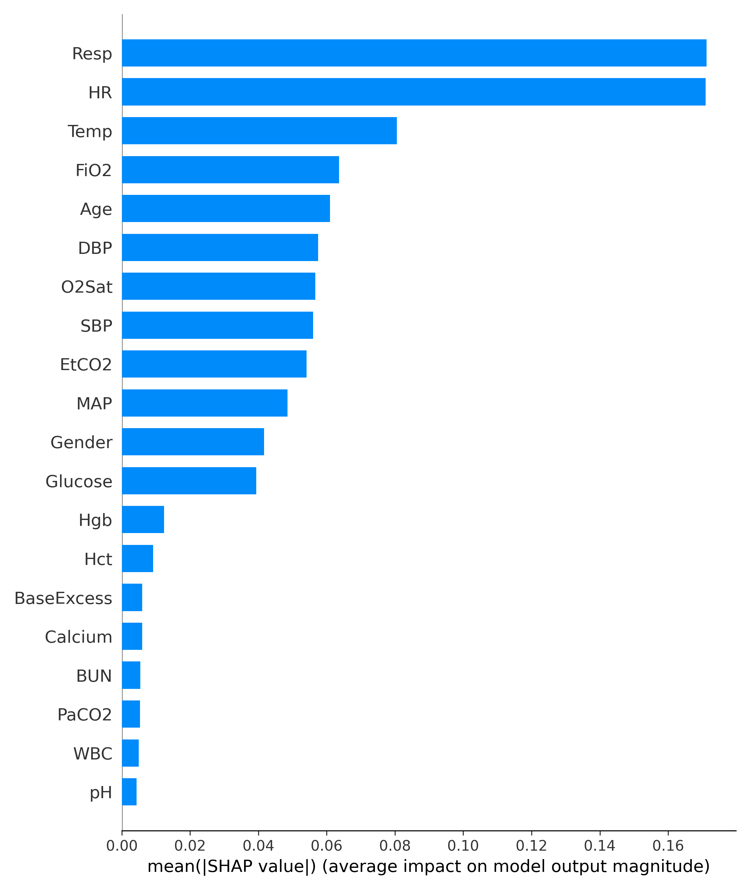

# Temporal Early Warning of Sepsis Deterioration in ICU Patients

## Overview
This repository explores a patient-level early warning framework for prospective sepsis risk prediction in ICU settings.
The primary focus is on maintaining temporal validity, preventing information leakage, and examining clinically plausible risk drivers, rather than maximizing predictive performance.

The implementation is designed as a learning-oriented, research-style prototype that follows common constraints in clinical machine learning, including patient-level data separation and horizon-based outcome definition.

This work does not aim to provide a deployable clinical system, but instead serves as a structured exploration of early warning modeling principles in ICU data.
## Problem Formulation

The task is formulated as prospective risk prediction within a fixed future horizon. At each ICU hour, the model estimates the probability of sepsis onset occurring within the next predefined time window, explicitly avoiding retrospective labeling schemes.

## Data Handling and Temporal Integrity
All preprocessing preserves strict within-patient temporal ordering. Train–test partitioning is performed at the patient level to prevent leakage across correlated ICU time points.

No feature engineering relies on future observations.

## Early Warning Label Construction

Early warning labels are assigned to observations that fall within a fixed prediction horizon preceding the first recorded sepsis onset for each patient. This formulation reflects a clinically actionable early warning setting rather than post hoc detection.

## Modeling

A gradient-boosted decision tree model (LightGBM) is trained under extreme class imbalance. Model configuration prioritizes stable discrimination and generalization over aggressive optimization.

## Evaluation

Performance is reported using threshold-free metrics (AUROC and PR-AUC) to reflect pre-deployment discrimination under severe outcome imbalance. No operating threshold is tuned or optimized in this study.

## Interpretability

Global feature attributions are examined using SHAP to inspect dominant physiological drivers influencing risk estimates.

See global feature importance visualization: 

# Notes

This project was developed as part of a learning process to strengthen methodological foundations in clinical machine learning.
Design choices prioritize correctness, transparency, and interpretability over aggressive optimization or alert threshold tuning.

Model outputs and performance metrics should be interpreted within the context of the chosen prediction horizon and the inherent difficulty of prospective sepsis prediction.

Interpretability analysis is used for model inspection rather than causal inference.

